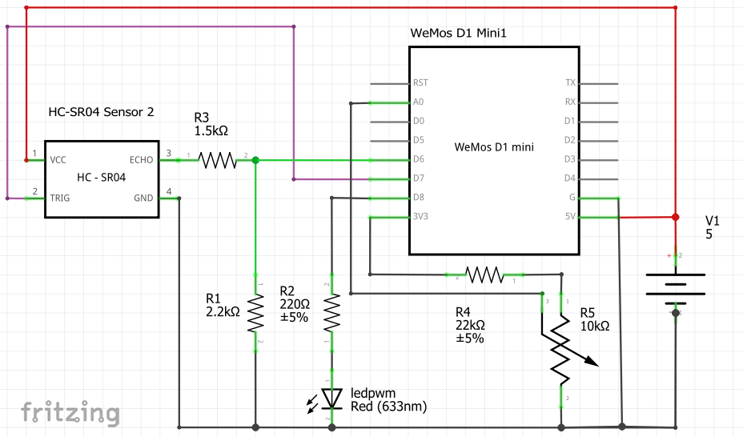

### Nivel_wemos_rasp 
#### Sistema medicao de Nivel com uso do SR04T, Wemos, Raspberry. 
- Wemos envia pacote UDP na rede wireless interna, neste caso para o Raspberry. 
- Wemos envia valores para a internet, neste caso para o site Thingspeak. 
- Wemos disponibiliza uma pagina WEB na rede interna para consulta de valor instantâneo e historico. 

#### Composição do sistema para medida de nivel.

##### 1. Componentes:
- Medidor de distancia: Módulo Sensor Ultrassônico Impermeável Jsn-sr04t
- Módulo programavel com WI-FI: Módulo Wemos D1 Mini Com Wifi Esp8266 Esp-12
- Mini Computador: Raspberry Pi3 Model B + fonte

##### 2. Programa:
 - Wemos: Wemos_sr04_V2_220926_git.ino - Nova versão - procure por "preencher" para ajustar com suas informações
 - Raspberry: --depois-- Um programa para receber os dados do wemos e outro para disponibiizar por web.

##### 3. Esquemático:  
- Wemos Mini D1 + SR04T + Potenciometro + LedPWM   
  

   

---
### ++++ **CUIDADO** ++++  Considere a adaptacao de nivel 3,3V entre o WEMOS e o SR04T (R1 e R3). 
###                        A entrada A0 deve variar de 0 a 1V máximo.
---
